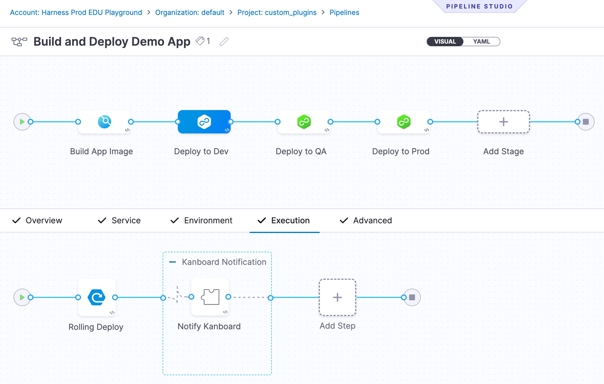
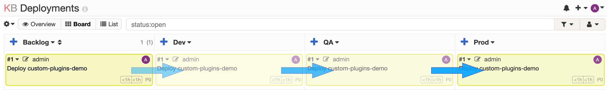
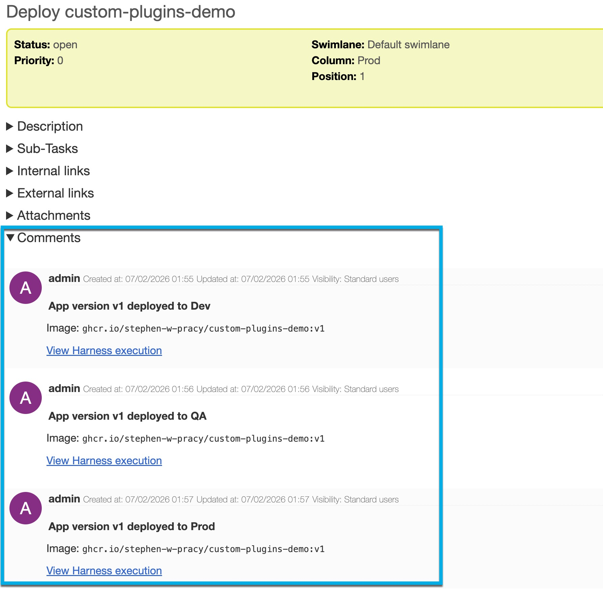
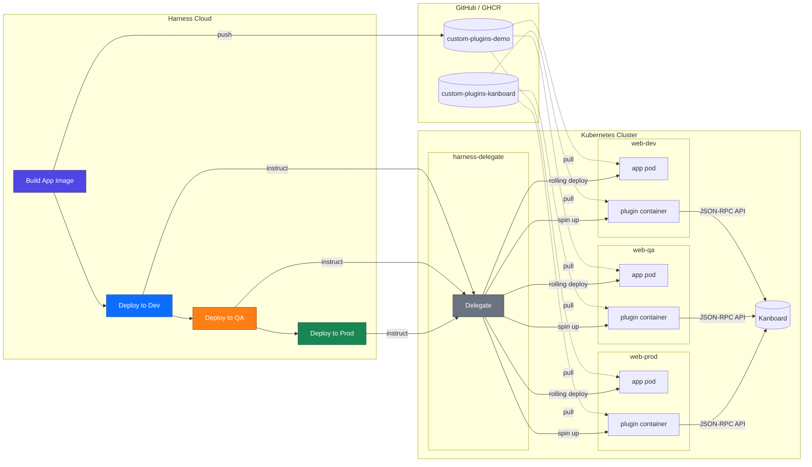
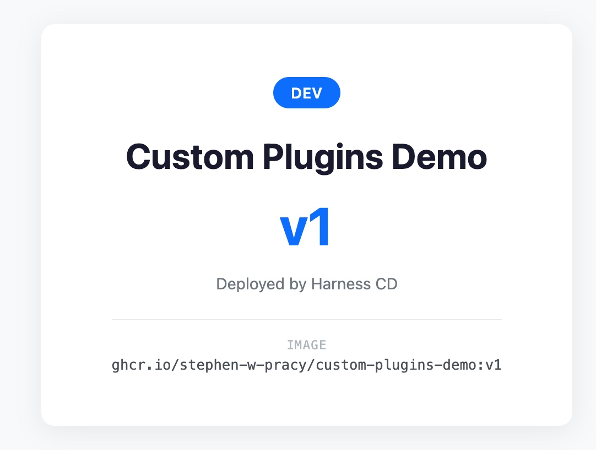
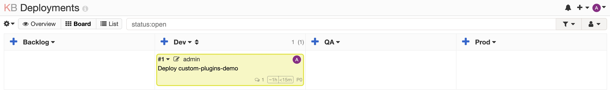
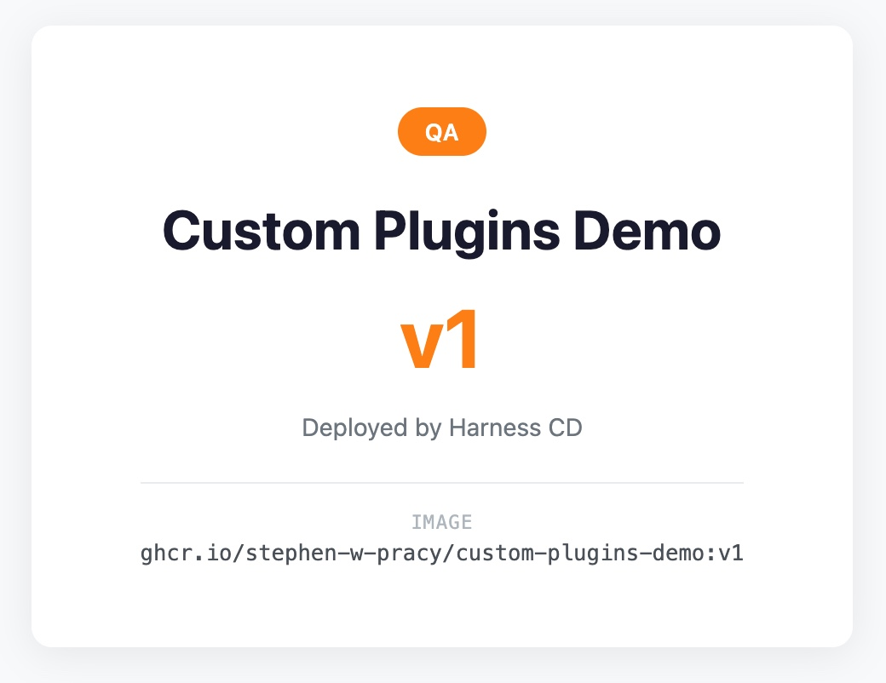
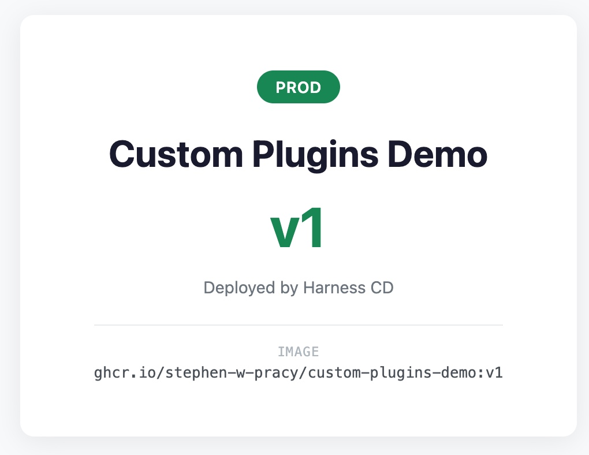

# Custom Plugins — Extend Harness CD with a Containerized Step

This repository accompanies a Technical Tidbit video. It provides a
reproducible demo you can run in your own Harness account and Kubernetes
cluster to practice **Custom Plugins in a CD context** — a containerized
plugin step that drives an external ITSM workflow 
([Kanboard](https://kanboard.org/)) after each deploy, from Dev → QA → Prod.



After each deployment stage, the plugin moves a Kanboard task to the next column and posts a comment with the app version, image, and a link back to the Harness execution.



When the task is deployed to Prod, the Kanboard task is in the Prod column with three comments, one from each stage.



## What You Will Learn

1. **The Plugin step itself** — reference a containerized image from a pipeline
   step (here: a small Python image that talks to Kanboard).
2. **Container Step Group wrapping (the CD-specific bit)** — wrap a Plugin
   step in a `stepGroup` with `stepGroupInfra: KubernetesDirect` so a
   Deployment stage has somewhere to run the container.
3. **Building the plugin image in Harness CI** — a separate short pipeline
   that builds `plugin/Dockerfile` on Harness Cloud and pushes to GHCR.
4. **Secrets injected into a plugin's environment** — the standard
   `<+secrets.getValue("...")>` syntax inside the Plugin step's `settings:`
   block.
5. **Per-environment plugin parameters** — one image, three runs, three
   different target columns via `<+env.variables.column_id>`. The plugin
   also comments back to Kanboard with the app version, image, and a link to
   the Harness execution.

## Why This Matters for CD

Harness's Plugin step is CI-native: it drops into a CI stage without ceremony.
In a CD Deployment stage there is no built-in container runtime, so a bare
Plugin step won't start. The fix is small but not obvious: **wrap the Plugin
step in a Container Step Group** with `stepGroupInfra: KubernetesDirect`, and
point it at a Kubernetes connector and namespace. That block is what tells
Harness where to spin up the plugin container.

Aside from that detail, the plugin step is identical in CI and CD.

The plugin itself is small: 30 lines of Python in `plugin/entrypoint.py` and
a 4-line Dockerfile. It calls to the Kanboard service's API endpoint from
within the cluster. The interesting work is on the pipeline side, and
that's where the video and this README spend their time.

## Repository Structure

```
app/
  server.py                    # Python stdlib HTTP server (serves HTML from ConfigMap)
  Dockerfile                   # Container image for the demo app
plugin/
  entrypoint.py                # Kanboard plugin. Moves the demo task, posts a comment
  Dockerfile                   # Container image for the plugin (python:3.12-alpine + kanboard)
k8s/
  deployment.yaml              # Kubernetes Deployment (with imagePullSecrets)
  service.yaml                 # ClusterIP Service
  configmap.yaml               # HTML page template (Go templating)
  Dev.yaml                     # Values file for the Dev environment (blue badge)
  QA.yaml                      # Values file for the QA environment (orange badge)
  Prod.yaml                    # Values file for the Prod environment (green badge)
.harness/
  pipeline.yaml                # CI/CD pipeline: Build App → Deploy Dev → QA → Prod
  build-plugin-pipeline.yaml   # CI pipeline that builds the plugin image
  service.yaml                 # Harness Service entity
  environment-dev.yaml         # Dev environment (with column_id variable)
  environment-qa.yaml          # QA environment (with column_id variable)
  environment-prod.yaml        # Prod environment (with column_id variable)
  infra-dev.yaml               # Dev infrastructure (namespace web-dev)
  infra-qa.yaml                # QA infrastructure (namespace web-qa)
  infra-prod.yaml              # Prod infrastructure (namespace web-prod)
  connector-github.yaml        # GitHub code connector
  connector-ghcr.yaml          # GHCR Docker registry connector
  connector-k8s.yaml           # K8s cluster connector
scripts/
  setup.sh                     # Automated provisioning (Harness + cluster + delegate + Kanboard)
  cleanup.sh                   # Tears everything down
  port-forward.sh              # Foreground port-forward to Dev, QA, Prod, and Kanboard
  validate-setup.sh            # Pre-flight environment checks
  verify-setup.sh              # Post-run check that every Harness resource was created
docs/
  resource-map.md              # Identifier graph + templating-layer ownership
  placeholders.md              # ${VAR} → .env → consuming-files table
```

## Prerequisites

- A Kubernetes cluster you can `kubectl` into (the Harness Delegate, the demo app, and Kanboard all run here)
- `kubectl` configured to access your cluster; `helm`, `curl`, `envsubst`, `jq`, `yq`, `openssl` installed locally (no local `docker` — image builds run on Harness Cloud)
- A Harness account (free tier works) — [sign up](https://app.harness.io/auth/#/signup)
- A GitHub account (for forking this repo and as a container registry via GHCR)
- A GitHub Personal Access Token (classic) with these scopes: `repo`, `write:packages`, `read:packages`
- Permissions to create Projects, Connectors, Secrets, Services, Environments, Infrastructures, and Pipelines in Harness, and Harness Cloud build credits available

## Setup

This repository contains a `scripts/setup.sh` script that provisions
everything for you using the [Automated](#automated-setup) steps.
Alternatively, you can follow the [Manual](#manual-setup) steps.

Whichever method you choose, follow these two steps first.

1. Collect Required Variable Values

   | Variable                     | Where to find it                                                                                                                  |
   |------------------------------|-----------------------------------------------------------------------------------------------------------------------------------|
   | Harness Account ID           | In the account URL: <code>https:&#47;&#47;app.harness.io/ng/account/<strong style="color:orange">ACCOUNT_ID</strong>/...</code>   |
   | Harness Org                  | In the org URL: <code>https:&#47;&#47;app.harness.io/ng/ACCOUNT_ID/all/orgs/<strong style="color:orange">ORG_ID</strong>/...</code> |
   | Harness Project              | In the project URL: <code>.../ACCOUNT_ID/all/orgs/ORG_ID/projects/<strong style="color:orange">PROJECT_ID</strong>/...</code>[^1] |
   | Harness PAT                  | In **User profile** → **My API Keys** → **&lt;API_KEY&gt;** → **Tokens**[^2]                                                       |
   | GitHub username              | For your fork and GHCR                                                                                                            |
   | GitHub Personal Access Token | Classic token with `repo`, `write:packages`, `read:packages` scopes                                                               |

   [^1]: The automated setup can create a Harness project for you (`CREATE_PROJECT=true`).
   [^2]: You can create a new API key and/or token if you don't have one already or want to use one specifically for this demo.

2. Fork and Clone This Repository

   Fork this repository to your GitHub account, then clone it locally:

   ```bash
   git clone https://github.com/<your-username>/cd-tidbit-custom-plugins.git
   cd cd-tidbit-custom-plugins
   ```

### Automated Setup

Requirements: `curl`, `kubectl`, `helm`, `jq`, `yq`, `envsubst` (part of
`gettext`), and `openssl`.

`scripts/setup.sh` provisions everything for you: the Harness project
(optional), three text secrets, three connectors, one service, three
environments and infrastructures, and both pipelines — plus your cluster
namespaces, the GHCR image pull secret, a Harness Delegate via Helm, and
Kanboard via Helm with a non-interactive JSON-RPC bootstrap that creates
the demo project, columns, and task.

1. Create a `.env` file from the example and fill in your values:

   ```bash
   cp .env.example .env
   ```

   Edit this file and supply the values you collected above. Leave the
   `KANBOARD_*` keys blank — `setup.sh` populates them.

2. Dry-run the setup script. It prints each API request, rendered YAML
   body, and cluster/Helm command, with secrets redacted, without touching
   your account or cluster.

   ```bash
   ./scripts/setup.sh --dry-run
   ```

   Review the output to ensure the correct values are being used.

3. Run the setup script for real.

   ```bash
   ./scripts/setup.sh
   ```

   It's re-runnable — existing resources are updated rather than
   duplicated. Set `CREATE_PROJECT=false` in `.env` to target an existing
   org/project instead of creating one.

   The full transcript is written to `setup.log` (gitignored, no secrets). If a
   step fails the script stops and prints a banner naming the step, command, and
   exit code — check `setup.log` for details, fix the cause, and re-run.

4. Confirm every Harness resource was created:

   ```bash
   make verify
   ```

   `make validate` runs *pre-flight* checks (tools, `.env`, cluster); `make
   verify` runs *after* setup and GETs each Harness resource (project, secrets,
   connectors, service, environments, infrastructures, pipelines), exiting
   non-zero if any is missing.

5. Proceed to [Build the Plugin Image](#build-the-plugin-image)

### Manual Setup

### 1. Install the Harness Delegate

The Delegate is an agent that runs in your cluster and executes pipeline tasks.

```bash
helm repo add harness-delegate https://app.harness.io/storage/harness-download/delegate-helm-chart/
helm repo update

helm install harness-delegate harness-delegate/harness-delegate-ng \
  --namespace harness-delegate --create-namespace \
  --set delegateName=custom-plugins-delegate \
  --set accountId=<YOUR_ACCOUNT_ID> \
  --set delegateToken=<YOUR_DELEGATE_TOKEN> \
  --set managerEndpoint=https://app.harness.io \
  --set tags=helm-delegate
```

Find your Account ID in the account URL. Generate a Delegate Token at
**Account Settings → Access Control → Delegates → Tokens → New Token**
(separate from the delegate install wizard). The `tags=helm-delegate` value
must match the `delegateSelectors:` list in `connector-k8s.yaml`.

### 2. Create a Kubernetes Connector

1. Go to **Connectors → New Connector → Kubernetes Cluster**
2. Name: `pipeline-demo-cluster` (identifier: `pipelinedemocluster`)
3. Connection method: **Use a Harness Delegate** → select the delegate you just installed
4. Test the connection and save

### 3. Create a GitHub Connector

Harness needs access to your fork for the pipeline's codebase.

1. Go to **Connectors → New Connector → GitHub**
2. Configure:
   - Name: `custom-plugins-github` (identifier: `github`)
   - URL Type: **Repository**
   - Connection Type: **HTTP**
   - GitHub Repository URL: `https://github.com/<your-username>/cd-tidbit-custom-plugins`
   - Authentication: **Username and Token** — use your GitHub username and a Harness Secret containing your PAT
   - Enable API Access: **Token** — select the same secret
3. Connectivity Mode: **Connect through Harness Platform**
4. Test and save

### 4. Create a GHCR Connector

The build pipelines push the app and plugin images to GHCR, and the CD
pipeline pulls the plugin image from GHCR at run time.

1. Go to **Connectors → New Connector → Docker Registry**
2. Configure:
   - Name: `custom-plugins-ghcr` (identifier: `ghcrconn`)
   - Provider Type: **Other**
   - Docker Registry URL: `https://ghcr.io/<your-username>`
   - Authentication: **Username and Password** — use your GitHub username and the same PAT secret
3. Connectivity Mode: **Connect through Harness Platform**
4. Test and save

### 5. Create Kubernetes Namespaces

```bash
kubectl create namespace web-dev
kubectl create namespace web-qa
kubectl create namespace web-prod
kubectl create namespace kanboard
```

### 6. Create Image Pull Secrets

GHCR packages are private by default. Each web namespace needs credentials
to pull the demo app image.

```bash
for ns in web-dev web-qa web-prod; do
  kubectl create secret docker-registry ghcr-cred \
    --docker-server=ghcr.io \
    --docker-username=<your-github-username> \
    --docker-password=<your-github-pat> \
    -n "$ns"
done
```

> [!NOTE]
> If you make your GHCR package public (in GitHub → Packages → package
> settings → Danger Zone → Change visibility), you can skip this step for
> the demo app. The plugin image is pulled by Harness itself via the GHCR
> connector, not by the cluster.

### 7. Install Kanboard

Kanboard is the ITSM target the plugin talks to. Install it with the
community Helm chart:

```bash
helm repo add kanboard https://kube-the-home.github.io/kanboard-helm/
helm repo update

# Pick a random API token — the plugin authenticates as the reserved
# `jsonrpc` user with this value.
KANBOARD_API_TOKEN=$(openssl rand -hex 16)

helm upgrade -i kanboard kanboard/kanboard \
  --namespace kanboard --create-namespace \
  --set service.enabled=true \
  --set service.type=ClusterIP \
  --set service.port=8080 \
  --set-string application.env[0].name=API_AUTHENTICATION_TOKEN \
  --set-string application.env[0].value="${KANBOARD_API_TOKEN}"
```

### 8. Bootstrap the Kanboard Board

Kanboard needs a project, four columns (Backlog / Dev / QA / Prod), and a
single demo task. `scripts/setup.sh` does this over a transient
port-forward using `admin:admin`; if you're doing this manually, open the
Kanboard UI (see [Run the Demo](#run-the-demo) below) and:

1. Sign in as `admin` / `admin`
2. Create a project named **Deployments**
3. Rename the four default columns to **Backlog**, **Dev**, **QA**, **Prod**
4. Add a task titled **Deploy custom-plugins-demo** in the **Backlog** column
5. Note the project id, task id, and column ids — you'll need them in steps 11 and 12

### 9. Create Harness Secrets

Create three text secrets in your project:

- `ghcr_token` — the GitHub PAT (backs the GHCR and GitHub connectors)
- `kanboard_url` — e.g. `http://kanboard.kanboard.svc.cluster.local:8080/jsonrpc.php`
- `kanboard_api_token` — the value you set in step 7

### 10. Create a Service in Harness

1. Go to **Services → New Service**
2. Name: `custom-plugins-demo` (identifier: `custom_plugins_demo`)
3. Deployment Type: **Kubernetes**
4. Add the manifest:
   - Type: **K8s Manifest** → Store: **GitHub**
   - Connector: `github`
   - Branch: `main`
   - File/Folder Paths: `k8s/deployment.yaml`, `k8s/service.yaml`, `k8s/configmap.yaml`
   - Values YAML Path: `k8s/<+env.name>.yaml` (set the field type to Expression `f(x)`)
5. Add primary artifact:
   - Type: **Docker Registry**
   - Connector: `ghcrconn`
   - Image Path: `<your-username>/custom-plugins-demo`
   - Tag: set to Runtime Input (`<+input>`)

> [!NOTE]
> The Service selects its values file by environment name
> (`k8s/<+env.name>.yaml`), so the environments must be named exactly
> **Dev**, **QA**, and **Prod** to match `k8s/Dev.yaml`, `k8s/QA.yaml`, and
> `k8s/Prod.yaml`.

### 11. Create Environments and Infrastructure

Create three Environments:
- **Dev** — type: Pre-Production, with an environment variable `column_id` set to the Dev Kanboard column id (from step 8)
- **QA** — type: Pre-Production, with `column_id` = QA column id
- **Prod** — type: Production, with `column_id` = Prod column id

For each Environment, create an Infrastructure Definition:
- Name: `Dev_Infra` / `QA_Infra` / `Prod_Infra`
- Infrastructure Type: **Kubernetes Direct**
- Connector: `pipelinedemocluster`
- Namespace: `web-dev` / `web-qa` / `web-prod`
- **Release Name**: leave at the default `release-<+INFRA_KEY_SHORT_ID>`.

### 12. Create Both Pipelines

1. In your project, go to **Pipelines → Create a Pipeline**
2. Switch to the **YAML** editor and paste the contents of
   `.harness/build-plugin-pipeline.yaml` (substituting the `${...}`
   placeholders with your own values). Save.
3. Repeat for `.harness/pipeline.yaml`. This is the main
   **Build and Deploy Demo App** pipeline.

> [!NOTE]
> The YAML files in `.harness/` contain `${...}` placeholders (e.g.
> `${HARNESS_ORG}`, `${GITHUB_USERNAME}`, `${KANBOARD_PROJECT_ID}`) used by
> the automated setup script. If you paste these files manually, replace
> each placeholder with your own value first. Harness expressions like
> `<+env.name>` are **not** placeholders and should be left as-is. See
> [docs/placeholders.md](docs/placeholders.md) for the full list. Be sure to
> also set the `kanboard_project_id` and `kanboard_task_id` pipeline variables
> (under **Pipeline Variables**) to the project id and task id you noted in
> step 8.

## Build the Plugin Image

The plugin image could be built locally or live in any artifact registry. In
this demo, you'll build it in Harness CI and push to GHCR so the CD pipeline
can pull it.

1. In Harness, open the **Build Kanboard Plugin** pipeline and click **Run**.
   The CI stage builds `plugin/Dockerfile` on Harness Cloud and pushes
   `ghcr.io/<your-username>/custom-plugins-kanboard:latest` (and a
   sequence-numbered tag) to GHCR. You only need to do this once — or
   again whenever `plugin/` changes.

The pipeline architecture is described in the next section.

## How the Pipeline Works



- **Build App Image (CI)**: Builds the demo app from `app/Dockerfile` on
  Harness Cloud and pushes `ghcr.io/<user>/custom-plugins-demo:v<sequenceId>`
  to GHCR.
- **Deploy to Dev / QA / Prod**: Each deploy stage does two things —
  1. A **K8s Rolling Deploy** rolls the new app image into the environment's
     namespace, picking up the environment-specific `k8s/<Env>.yaml` values
     file (blue / orange / green badge).
  2. A **Container Step Group** named *Kanboard Notification* runs the
     plugin container. The step group's `stepGroupInfra: KubernetesDirect`
     block points at the K8s connector and namespace where the plugin
     spins up. The plugin moves the demo card to this environment's Kanboard
     column and posts a comment with the app version, image, and a link
     back to the Harness execution.

The **same plugin image** runs three times in one execution; only the
`KANBOARD_COL` setting differs per stage (resolved from
`<+env.variables.column_id>`).

**The five features in action:**

| Feature                                       | Where                                                                                    | What it does                                                                                                          |
|-----------------------------------------------|------------------------------------------------------------------------------------------|-----------------------------------------------------------------------------------------------------------------------|
| Plugin step (containerized)                   | `.harness/pipeline.yaml` — `type: Plugin` inside each deploy stage's step group          | References a Docker image and passes `settings:` in as `PLUGIN_*` env vars                                            |
| Container Step Group (`stepGroupInfra`)       | `.harness/pipeline.yaml` — `stepGroup` wrapping each Plugin step                         | Gives a Deployment stage a Kubernetes container runtime so the Plugin container has somewhere to run                  |
| Plugin image source                           | `plugin/Dockerfile` + `plugin/entrypoint.py`; built by `build_kanboard_plugin` pipeline  | 30 lines of Python + a 4-line Dockerfile — the whole plugin                                                           |
| Secret reference in plugin `settings:`        | `KANBOARD_API_TOKEN: <+secrets.getValue("kanboard_api_token")>` in `pipeline.yaml`       | Injects Harness-managed secrets into the container without exposing them in the YAML                                  |
| Per-environment parameter + traceability      | `KANBOARD_COL: <+env.variables.column_id>` and the four `APP_VERSION`/`ENV_NAME`/`IMAGE`/`EXECUTION_URL` settings | Same image, different column per stage; the plugin also posts a Kanboard comment with app version + image + execution link |

**About the plugin image tag.** The main pipeline references the plugin as
`ghcr.io/<user>/custom-plugins-kanboard:latest`. That's the pragmatic
choice for a demo: the app pipeline cannot easily determine the plugin
pipeline's `sequenceId` at run time, so `:latest` avoids a manual coordination
step every time the plugin changes. In production, you would tighten this up
one of three ways:

- **Runtime input**: expose `plugin_image` as `<+input>` on the CD
  pipeline and pass the exact tag when triggering the run

- **Digest pin**: reference the plugin by content-addressable digest
  (`@sha256:...`) so a re-published `:latest` cannot silently swap the
  image

- **Trigger chaining**: have the plugin build pipeline update the CD
  pipeline's `plugin_image` variable via a webhook or trigger

**Version label.** The app version shown on the page and used as the
image tag is `v<+pipeline.sequenceId>` — it increments by one on every run.
Your first run in a fresh project will be `v1`.

## Run the Demo

The golden path is a single pipeline run that marches through Dev → QA →
Prod. As each stage's deploy completes, that stage's plugin step moves the
demo card to the next Kanboard column and comments on it.

> [!NOTE]
> The version numbers are derived from the pipeline's execution sequence
> id (`v<+pipeline.sequenceId>`). Your first run in a fresh project will
> be `v1`, but if you've run the pipeline during setup you'll see higher
> numbers. That's expected.

Before the run, start the port-forwards so you can watch the app and
Kanboard live:

```bash
make port-forward
# Forwards Dev → :8080, QA → :8081, Prod → :8082, Kanboard → :8090
# Ctrl-C stops all four.
```

> [!NOTE]
> Until you run the pipeline, you will see a stream of connection
> errors about the dev, qa, and prod services not found. You can ignore these.

Open the Kanboard UI at [http://localhost:8090](http://localhost:8090)
(sign in as `admin` / `admin`) and confirm the **Deploy custom-plugins-demo**
task is sitting in the **Backlog** column.

### Step 1 — Tour the plugin and the board

1. Open [entrypoint.py](./plugin/entrypoint.py). 

2. Examine the `PLUGIN_*` prefixed environment variables the plugin expects.
   Note `PLUGIN_ENV_NAME` in particular, as this value will be different for
   each stage of the CD pipeline.

3. Find the `kb.move_task_position(...)` call, and the `kb.create_comment(...)`
   call. These are the two actions the plugin performs on Kanboard for each
   deployment stage.

4. In your Harness project, navigate to **Pipelines** and open the **Build and
   Deploy Demo App** pipeline in visual mode. For each stage, open the
   **Execution** tab to see the steps. Examine the **Kanboard Notification** step
   group and plugin step configurations.

5. Open the plugin step and examine **Settings**. Note the `settings:` map.
   The `KANBOARD_COL` value is resolved from the environment variable you set
   in the Harness Environment (`<+env.variables.column_id>`).

   Other **Settings** keys become env vars with a `PLUGIN_` prefix inside the
   container. 

### Step 2 — Trigger the pipeline; watch Build + Dev

1. In Harness, open the **Build and Deploy Demo App** pipeline and click
   **Run**.
2. Watch the **Build App Image** stage complete — it builds
   `ghcr.io/<you>/custom-plugins-demo:v<run-number>` on Harness Cloud.
3. The **Deploy to Dev** stage runs its **Rolling Deploy** step, then the
   **Kanboard Notification** step group runs the plugin container.

   **What happens:**
   - Dev pods roll to the new tag.
   - The plugin container moves the demo card from **Backlog → Dev** and
     posts a comment with the app version, image, and execution URL.

Verify Dev is live:

```bash
# Assumes `make port-forward` is still running from above.
open http://localhost:8080
```

You should see a page with a **blue** badge and the current version
number.





### Step 3 — Watch QA

The pipeline advances to **Deploy to QA**.

**What happens:**
- QA pods roll to the same tag Dev just deployed (`useFromStage` reuses
  the artifact).
- The plugin runs a second time. Same image; different `KANBOARD_COL`
  (this one resolved from the **QA** environment's `column_id` variable).
  Card hops **Dev → QA**.
- A second comment is posted on the task — same format, updated
  `ENV_NAME`.

Verify at [http://localhost:8081](http://localhost:8081) — orange badge.



### Step 4 — Watch Prod

The pipeline advances to **Deploy to Prod** and finishes green.

**What happens:**
- Prod pods roll.
- The plugin runs a third time. Card hops **QA → Prod**. A third comment
  is posted.

Verify at [http://localhost:8082](http://localhost:8082) — green badge.



To re-run the demo, drag the card back to **Backlog** in Kanboard and
trigger the pipeline again.

## Future Enhancements

Things the tidbit deliberately omits but a learner might layer in next:

- **Approval gates between stages.** Wrap each Plugin step in a manual
  approval, or add a Harness Approval step before the Plugin step. Shows
  that the plugin only fires on confirmed promotions.
- **Pipeline triggered by Kanboard events.** Use a Kanboard webhook to
  POST to a Harness Custom Trigger when a card is dragged into a "Ready
  to Deploy" column — closing the loop in the other direction.
- **Plugin failure handling.** Make the plugin step a non-blocking
  notification (`failureStrategy: ignore`) so a Kanboard outage doesn't
  block deploys.
- **One plugin, many ITSM targets.** Add a `TARGET=kanboard|jira|servicenow`
  env var and switch on it in the entrypoint — same Plugin step shape for
  all.
- **Tighten the plugin tag.** Move `plugin_image` from `:latest` to
  `<+input>` (see [About the plugin image tag](#how-the-pipeline-works)),
  and have the CD pipeline require it as a runtime input.

## Cleanup

### Automated

If you used `scripts/setup.sh` to create the resources for this tutorial,
you can use `scripts/cleanup.sh` to delete them all.

1. Dry-run the cleanup script to preview what it will delete:

   ```bash
   ./scripts/cleanup.sh --dry-run
   ```

2. Run the cleanup script:

   ```bash
   ./scripts/cleanup.sh -y          # skips confirmation prompt
   ```

### Manual

#### Harness Resources

Delete the Harness project, which will cascade-delete all child resources.

1. In Harness, navigate to your project.
2. In the upper-right corner, click the 3-dot menu and select **Delete**.
3. In the confirmation dialog, type the project name to confirm.

#### Cluster Resources

```bash
# Uninstall the Kanboard release and namespace
helm uninstall kanboard -n kanboard
kubectl delete namespace kanboard

# Uninstall the delegate and its namespace
helm uninstall harness-delegate -n harness-delegate
kubectl delete namespace harness-delegate

# Delete the app namespaces
kubectl delete namespace web-dev web-qa web-prod
```

#### GHCR Packages

1. In GitHub, navigate to **Your profile → Packages**.
2. Delete `custom-plugins-demo` and `custom-plugins-kanboard`.

---

## Troubleshooting

**Kanboard notification step fails with 401 Unauthorized**

The plugin authenticates as Kanboard's reserved `jsonrpc` user using the
`API_AUTHENTICATION_TOKEN` that was injected into the Kanboard pod. Check
that the `kanboard_api_token` Harness secret and the Kanboard pod's
`API_AUTHENTICATION_TOKEN` env var have the same value (they were both set
by `setup.sh` from `KANBOARD_API_TOKEN` in `.env`). If you rotated one,
rotate the other.

**Container Step Group step fails to start**

The `stepGroupInfra: KubernetesDirect` block needs a working K8s connector
and a namespace the delegate can reach. Verify the `pipelinedemocluster`
connector is green in Harness, and that the delegate has permission to
create pods in the environment's namespace (`web-dev` / `web-qa` /
`web-prod`).

**Plugin step fails with "image not found" or `ImagePullBackOff`**

Run the **Build Kanboard Plugin** pipeline first — the plugin image must
exist in GHCR before the main pipeline runs. Also verify the `ghcrconn`
connector authenticates successfully (its `passwordRef` is the
`ghcr_token` secret).

**Card doesn't move but the step succeeds**

Wrong column, task, or project id. Check the `column_id` variable on each
environment (should match Kanboard's Dev/QA/Prod column ids from
`.env`) and `kanboard_project_id` / `kanboard_task_id` on the pipeline.
`kubectl exec` into the Kanboard pod, or hit its API directly, to confirm
the current ids.

**Build stage fails with 429 Too Many Requests**

Public registries (Docker Hub) throttle occasionally. Wait a few minutes
and re-run.

**Build stage fails with registry auth errors**

Verify your GHCR connector credentials. The PAT needs `write:packages`
scope. Ensure the connector URL includes your username:
`https://ghcr.io/<your-username>`.

**ImagePullBackOff / 401 Unauthorized on demo app pods**

Your GHCR package is private (the default). Create the `ghcr-cred` secret
in each web namespace (see Setup step 6 above), or make the package public.

**x509: certificate signed by unknown authority**

Your cluster can't verify the registry's TLS certificate. This commonly
happens with corporate TLS inspection proxies (Zscaler, Netskope). Add
your corporate CA bundle to the cluster's trusted certificates, or switch
to a cluster outside the inspection path.

**Pipeline import fails**

Ensure your Git connector can reach your fork. The PAT needs `repo` scope
for private repos (or the repo must be public).

### Helpful commands for inspecting the cluster

```bash
# Check deployment status
kubectl get deploy,po -n web-dev
kubectl get deploy,po -n web-qa
kubectl get deploy,po -n web-prod
kubectl get deploy,po -n kanboard

# Check which image is running
kubectl get po -n web-prod -o jsonpath='{range .items[*]}{.metadata.name}: {.spec.containers[0].image}{"\n"}{end}'

# Port-forward to view the apps + Kanboard (recommended — auto-reconnects when pods rotate)
make port-forward
# Dev → http://127.0.0.1:8080
# QA  → http://127.0.0.1:8081
# Prod → http://127.0.0.1:8082
# Kanboard → http://127.0.0.1:8090

# Or one at a time:
kubectl port-forward svc/custom-plugins-demo 8080:80 -n web-dev
kubectl port-forward svc/kanboard             8090:8080 -n kanboard
```

## Further Reading

- [Harness Plugin step](https://developer.harness.io/docs/continuous-delivery/x-platform-cd-features/cd-steps/containerized-steps/plugin-step/)
- [Write custom plugins](https://developer.harness.io/docs/continuous-integration/use-ci/use-drone-plugins/custom_plugins/)
- [Containerize Step Groups](https://developer.harness.io/docs/continuous-delivery/x-platform-cd-features/cd-steps/containerized-steps/containerized-step-groups/)

